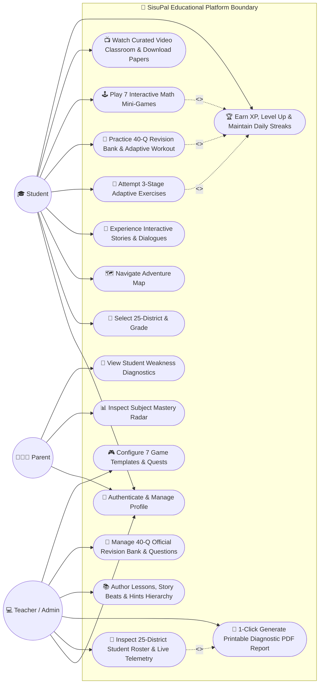
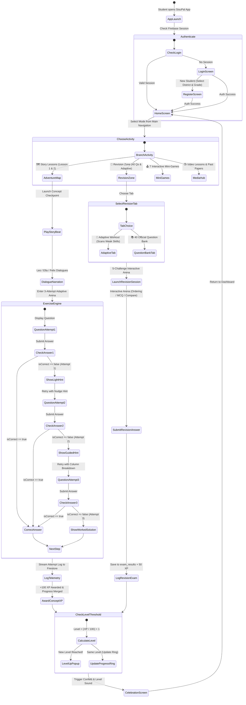
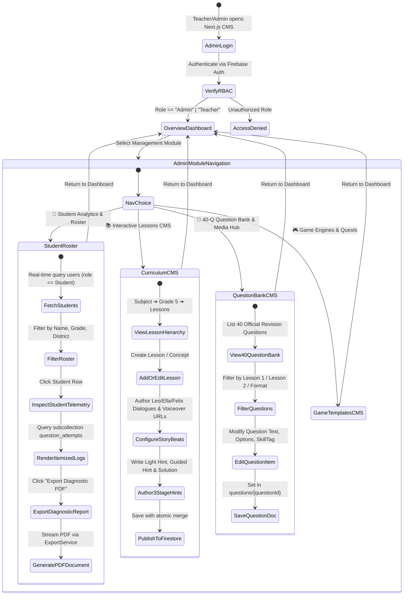
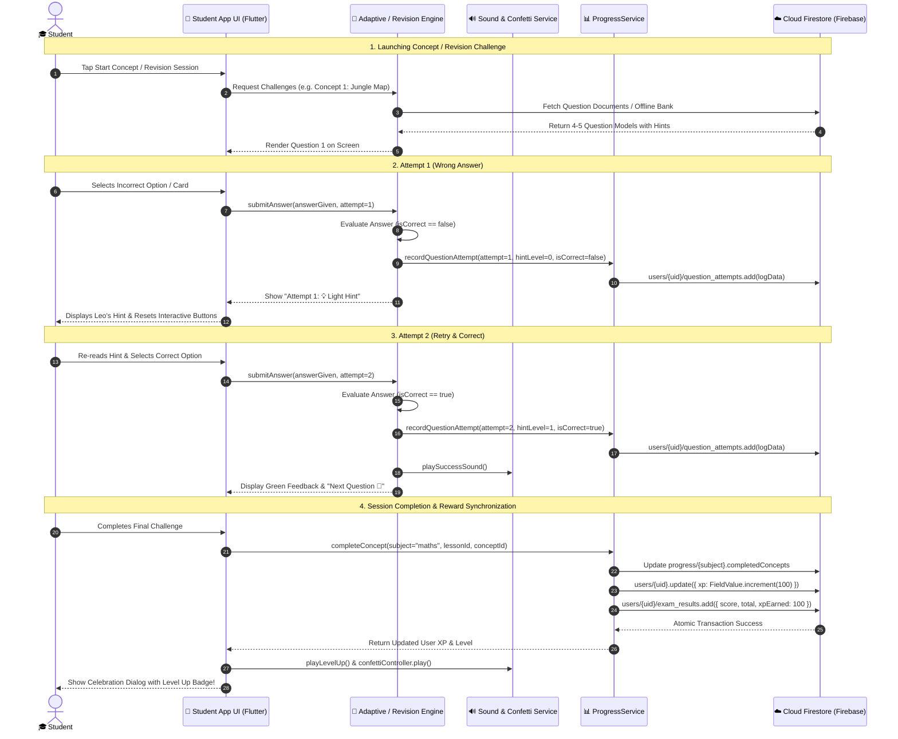
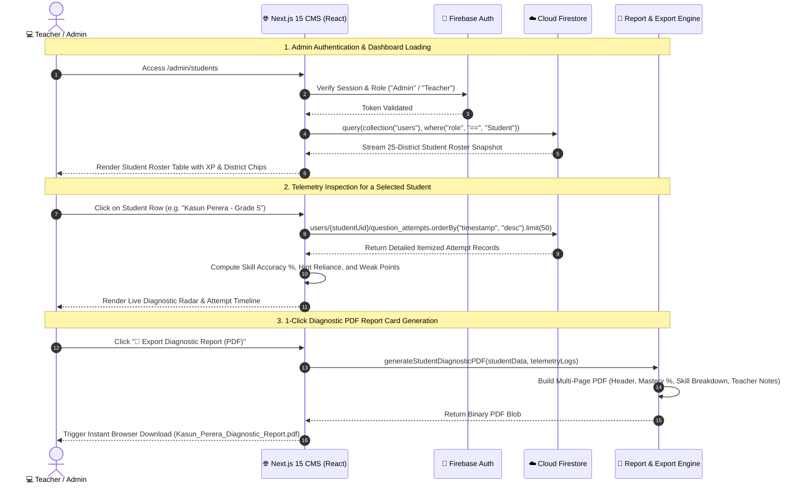
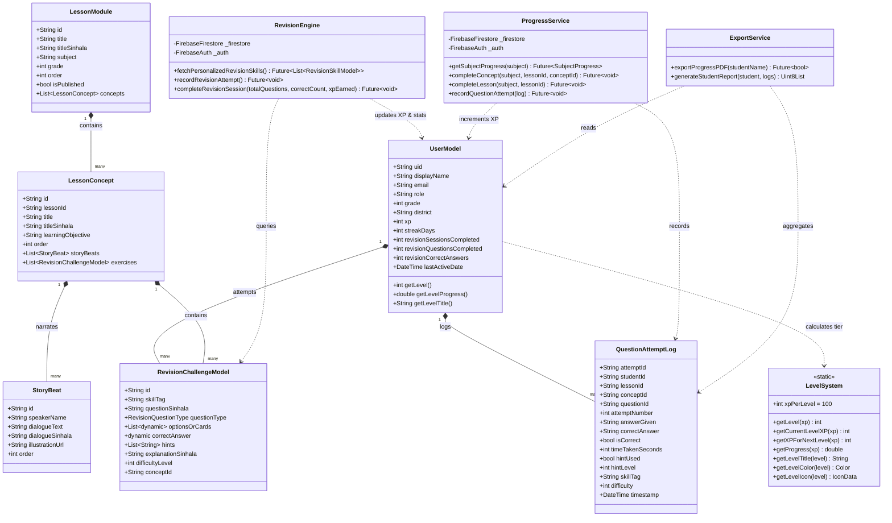

# SisuPal (සිසුපල්) V2 – Comprehensive Master Technical & Architectural Documentation

---

## 📖 Executive Summary

**SisuPal (සිසුපල්)** is a state-of-the-art, gamified educational ecosystem meticulously designed for Sri Lankan primary school students (Grade 5 Scholarship Examination / ශිෂ්‍යත්ව විභාගය). The platform bridges interactive gamified learning, narrative story-driven lessons, 3-attempt adaptive diagnostic exercises, automated real-time telemetry tracking, and parent/teacher analytics into a unified cloud-synchronized experience.

The platform comprises two integrated systems:
1. **SisuPal Student Mobile & Web Application**: Built with **Flutter (Dart)** supporting Android, iOS, Windows, and Web.
2. **SisuPal Admin & Teacher CMS Dashboard**: Built with **Next.js 15 (App Router)**, **TypeScript**, and **Tailwind CSS**.
3. **Cloud Infrastructure & Backend**: **Firebase Firestore**, **Firebase Authentication**, **Firebase Storage**, and **Cloud Functions**.

---

## 🏛️ Comprehensive Multi-Tier System Architecture

```mermaid
flowchart TB
    %% ==========================================
    %% TIER 1: PRESENTATION & CLIENT LAYER
    %% ==========================================
    subgraph TIER1["📱 TIER 1: PRESENTATION & CLIENT APPLICATIONS"]
        direction TB

        subgraph STUDENT_APP["🎓 SisuPal Student App (Flutter Multi-Platform - Android / iOS / Web / Windows)"]
            direction TB
            UI_HOME["🏠 Main Navigation & Gamification Dashboard\n(XP Progress Ring • Level Badges • Streaks)"]
            UI_LESSONS["📖 Story-Driven Interactive Lessons\n(Golden Mango Tree • The Great Number Train)"]
            UI_REVISION["🎯 Revision Zone (2-Tab Engine)\n(Adaptive Telemetry Workout • 40-Q Official Bank)"]
            UI_GAMES["🕹️ 7 Interactive Mini-Games\n(Abacus • Archery • Lily Pad • Digit Builder • etc.)"]
            UI_MEDIA["📺 Media Hub & PDF Classroom\n(Curated YouTube Player • Past Exam Papers)"]
            UI_PARENT["👨‍👩‍👧 Parent Portal & Progress Radar"]
        end

        subgraph ADMIN_CMS["💻 SisuPal Admin & Teacher CMS (Next.js 15 • App Router • Tailwind CSS)"]
            direction TB
            ADM_DASH["⚡ Real-Time Overview & Sync Monitor"]
            ADM_STUDENTS["👥 25-District Student Roster & Telemetry Inspector"]
            ADM_LESSONS["📚 Curriculum Hierarchy & Story Dialogue Builder"]
            ADM_MEDIA["🎥 Media Hub & 40-Question Bank CRUD"]
            ADM_GAMES["🎮 Game Templates & Quest Manager"]
            ADM_REPORTS["📄 1-Click Diagnostic PDF/CSV Generator"]
        end
    end

    %% ==========================================
    %% TIER 2: BUSINESS LOGIC & CORE ENGINES
    %% ==========================================
    subgraph TIER2["⚙️ TIER 2: BUSINESS LOGIC, SERVICES & ADAPTIVE ENGINES"]
        direction TB

        E_ADAPTIVE["🧠 3-Attempt Adaptive Engine\n(Attempt 1: Light Hint ➔ Attempt 2: Guided Step ➔ Attempt 3: Solution)"]
        E_REVISION["🔄 Revision & Weakness Engine\n(Telemetry Log Analyzer • Skill Prioritization • Custom Workouts)"]
        E_GAMIFY["🏆 Gamification & Level Engine\n(Level = ⌊XP/100⌋ + 1 • 6 Tier Badges • Daily Quests • Achievements)"]
        E_TELEMETRY["📊 Itemized Telemetry & Tracking Service\n(Per-question timestamps, attempts, accuracy %, hint levels)"]
        E_PDF["📑 Diagnostic Report Card Generator\n(Automated Student Assessment • Skill Radars • PDF Engine)"]
        E_AUDIO["🔊 Sound FX & Visual Animation Engine\n(Haptic Audio • Confetti Cannons • Tween Transitions)"]
    end

    %% ==========================================
    %% TIER 3: CLOUD BACKEND & DATA PERSISTENCE
    %% ==========================================
    subgraph TIER3["☁️ TIER 3: GOOGLE FIREBASE CLOUD INFRASTRUCTURE"]
        direction TB

        subgraph FIREBASE_AUTH["🔐 Firebase Authentication (RBAC)"]
            AUTH_STUDENT["Student Role (App)"]
            AUTH_PARENT["Parent Role (App)"]
            AUTH_ADMIN["Admin / Teacher Role (CMS)"]
        end

        subgraph FIRESTORE["🗄️ Cloud Firestore (Real-Time NoSQL Database)"]
            direction TB
            COL_USERS["📁 users/{uid}\n(Profiles • XP • Level • Streaks)"]
            COL_PROGRESS["↳ sub: progress/{subject}\n(Completed Lessons & Concepts)"]
            COL_ATTEMPTS["↳ sub: question_attempts/{id}\n(Itemized Telemetry Logs)"]
            COL_EXAMS["↳ sub: exam_results/{id}\n(Revision Session Records)"]
            COL_QUESTIONS["📁 questions/{id}\n(40 Official Revision Bank + Practice Qs)"]
            COL_LESSONS["📁 lessons/{id} & concepts/{id}\n(Curriculum Modules & Story Beats)"]
            COL_MEDIA["📁 videos/{id} & papers/{id}\n(YouTube Links & Exam Paper Metas)"]
            COL_GAMES["📁 game_templates & daily_quests"]
        end

        subgraph STORAGE["📦 Firebase Cloud Storage"]
            STORE_PDF["Exam Past Papers PDFs"]
            STORE_AUDIO["Story Narration & Audio"]
            STORE_IMG["Visual Illustrations & Sprites"]
        end

        SEC_RULES["🛡️ Firestore Security Rules\n(User Data Isolation • Admin Write Privileges)"]
    end

    %% ==========================================
    %% TIER 4: EXTERNAL INTEGRATIONS
    %% ==========================================
    subgraph TIER4["🌐 TIER 4: EXTERNAL SERVICES & OUTPUT PIPELINES"]
        EXT_YT["▶️ YouTube Video Streaming API"]
        EXT_PDF["🖨️ PDF Print & Download Subsystem"]
        EXT_DEVICE["📱 Mobile/Browser Hardware Engine"]
    end

    %% ==========================================
    %% CONNECTIONS & DATA FLOWS
    %% ==========================================
    %% Client to Engines
    STUDENT_APP -->|Executes Interactions| E_ADAPTIVE
    STUDENT_APP -->|Requests Workouts| E_REVISION
    STUDENT_APP -->|Earns XP & Badges| E_GAMIFY
    STUDENT_APP -->|Logs Attempts| E_TELEMETRY
    STUDENT_APP -->|Triggers SFX| E_AUDIO

    ADMIN_CMS -->|Reads Live Logs| E_TELEMETRY
    ADMIN_CMS -->|Exports Diagnostics| E_PDF
    ADMIN_CMS -->|Manages Bank| E_REVISION

    %% Engines to Backend
    E_ADAPTIVE & E_REVISION & E_TELEMETRY -->|Write Attempt Logs & Read Bank| FIRESTORE
    E_GAMIFY -->|Atomic XP Increment| COL_USERS
    E_PDF -->|Aggregates Analytics| COL_ATTEMPTS

    %% Clients to Auth & Storage
    STUDENT_APP & ADMIN_CMS <-->|JWT Tokens & RBAC| FIREBASE_AUTH
    STUDENT_APP & ADMIN_CMS <-->|Real-Time Snapshot Streams| FIRESTORE
    STUDENT_APP <-->|Download PDFs & Assets| STORAGE
    FIRESTORE --- SEC_RULES

    %% External Connections
    UI_MEDIA --> EXT_YT
    E_PDF --> EXT_PDF
    E_AUDIO --> EXT_DEVICE
```



---

## 📊 Formal UML Modeling & Specification Suite

### 1. 🎯 Use Case Diagram



---

### 2. ⚡ Activity Diagram – Student Learning & Revision Flow



---

### 3. 🛠️ Activity Diagram – Admin & Teacher Management Flow



---

### 4. 🔄 Sequence Diagram 1 – Student 3-Attempt Adaptive Lesson & Revision Session



---

### 5. 🔍 Sequence Diagram 2 – Admin Real-Time Telemetry & 1-Click PDF Report Export



---

### 6. 🏛️ Class Diagram – Core Domain Entities & Architectural Services



---

### 7. 🧩 Component Diagram

```mermaid
flowchart TB
    %% ==========================================
    %% FLUTTER STUDENT APP COMPONENT BOUNDARY
    %% ==========================================
    subgraph FLUTTER_COMP["📱 Component: Flutter Student Application Subsystem"]
        direction TB

        subgraph C_UI["Presentation & View Components"]
            COMP_UI_NAV["[Component]\nNavigation & UI Canvas\n(HomeScreen • MapView • SessionViews)"]
            COMP_UI_GAMES["[Component]\nGame Widgets & Canvas Renderer\n(AbacusCanvas • ArcheryView • LilyPadView)"]
            COMP_UI_ANIM["[Component]\nAnimation & SFX Player\n(ConfettiController • SoundService)"]
        end

        subgraph C_LOGIC["Pedagogical & Engine Components"]
            COMP_ADAPTIVE["[Component]\nAdaptive Exercise Engine\n«interface: IAdaptiveEngine»\n(3-Stage Hint Dispatcher)"]
            COMP_REVISION["[Component]\nRevision & Diagnostic Engine\n«interface: IRevisionEngine»\n(Telemetry Analyzer • Workout Builder)"]
            COMP_GAMIFY["[Component]\nGamification & Level Component\n«interface: IGamification»\n(LevelSystem • QuestTracker)"]
        end

        subgraph C_DATA["Client Data Access & Caching Components"]
            COMP_DATA_SVC["[Component]\nData Access Service\n(ProgressService • VideoTrackingService)"]
            COMP_LOCAL_CACHE["[Component]\nOffline Bank & Local Cache\n(MathsOfficialRevisionBank • GoldenMangoData)"]
        end

        COMP_UI_NAV --> COMP_ADAPTIVE
        COMP_UI_NAV --> COMP_REVISION
        COMP_UI_NAV --> COMP_GAMIFY
        COMP_UI_GAMES --> COMP_GAMIFY
        COMP_ADAPTIVE --> COMP_DATA_SVC
        COMP_REVISION --> COMP_DATA_SVC
        COMP_REVISION --> COMP_LOCAL_CACHE
        COMP_DATA_SVC --> COMP_LOCAL_CACHE
    end

    %% ==========================================
    %% NEXT.JS ADMIN CMS COMPONENT BOUNDARY
    %% ==========================================
    subgraph ADMIN_COMP["💻 Component: Next.js 15 Admin & Teacher CMS Subsystem"]
        direction TB

        subgraph C_ADM_UI["Admin Presentation Components"]
            COMP_ADM_VIEWS["[Component]\nAdmin View & DataTables\n(StudentRoster • TelemetryModal • MediaHub)"]
            COMP_ADM_AUTH["[Component]\nAuth & RBAC Guard\n(AuthProvider • ProtectedRoute)"]
        end

        subgraph C_ADM_CORE["Admin Authoring & Export Components"]
            COMP_CURRIC_BUILDER["[Component]\nCurriculum & Story Builder\n(HierarchyModal • StoryBeatAuthor)"]
            COMP_QUESTION_MGR["[Component]\nQuestion Bank Manager\n(40-Q CRUD • SeederScript)"]
            COMP_PDF_EXPORT["[Component]\nDiagnostic PDF Report Generator\n(ExportService • ReportGenerator)"]
        end

        COMP_ADM_VIEWS --> COMP_ADM_AUTH
        COMP_ADM_VIEWS --> COMP_CURRIC_BUILDER
        COMP_ADM_VIEWS --> COMP_QUESTION_MGR
        COMP_ADM_VIEWS --> COMP_PDF_EXPORT
    end

    %% ==========================================
    %% CLOUD & BACKEND SERVICES COMPONENT BOUNDARY
    %% ==========================================
    subgraph CLOUD_COMP["☁️ Component: Firebase Cloud Infrastructure"]
        direction TB
        COMP_FB_AUTH["[Component]\nFirebase Auth Service\n«port: HTTPS / JWT»"]
        COMP_FIRESTORE["[Component]\nCloud Firestore NoSQL Engine\n«port: gRPC / Realtime Stream»"]
        COMP_STORAGE["[Component]\nFirebase Cloud Storage\n«port: HTTPS Bucket»"]
        COMP_SEC_ENGINE["[Component]\nSecurity Rules Evaluator\n«internal filter»"]

        COMP_FIRESTORE --- COMP_SEC_ENGINE
    end

    %% ==========================================
    %% EXTERNAL COMPONENT BOUNDARY
    %% ==========================================
    subgraph EXT_COMP["🌐 External Services"]
        COMP_YT_API["[Component]\nYouTube Video Streaming API"]
        COMP_PRINT_ENGINE["[Component]\nClient Device PDF / Print Engine"]
    end

    %% Inter-Subsystem Communication
    COMP_DATA_SVC <-->|Sync Streams & Attempt Logs| COMP_FIRESTORE
    COMP_ADM_VIEWS <-->|Roster Query & Telemetry| COMP_FIRESTORE
    COMP_QUESTION_MGR <-->|Write Qs & Batches| COMP_FIRESTORE
    COMP_CURRIC_BUILDER <-->|Write Lessons & Beats| COMP_FIRESTORE
    COMP_ADM_AUTH <-->|Token Claims Verification| COMP_FB_AUTH
    COMP_DATA_SVC <-->|Session Tokens| COMP_FB_AUTH
    COMP_UI_NAV -->|Stream Videos| COMP_YT_API
    COMP_PDF_EXPORT -->|Render PDF Document| COMP_PRINT_ENGINE
    COMP_DATA_SVC <-->|Download PDFs & Audio| COMP_STORAGE
```



---

### 8. 🚀 Deployment Diagram

```mermaid
flowchart TB
    %% ==========================================
    %% NODE 1: CLIENT RUNTIME NODES
    %% ==========================================
    subgraph CLIENT_TIER["📱 CLIENT RUNTIME TIER"]
        direction TB

        subgraph NODE_ANDROID["💻 Execution Node: Android Mobile / Tablet Device"]
            ART_JVM["«execution environment»\nAndroid OS (API 21+)\n[JVM / ART Runtime]"]
            DEV_FLUTTER_APK["«artifact»\nsisupal-student-app.apk\n(Flutter Native ARM64/x86 Binary)"]
            DEV_SQLITE["«database»\nLocal Cache / Shared Preferences"]
            ART_JVM --- DEV_FLUTTER_APK
            DEV_FLUTTER_APK --- DEV_SQLITE
        end

        subgraph NODE_IOS["💻 Execution Node: Apple iOS Device"]
            IOS_RUNNER["«execution environment»\niOS (13.0+)\n[Darwin / WebKit Runtime]"]
            DEV_FLUTTER_IPA["«artifact»\nRunner.ipa\n(Flutter Native AOT Binary)"]
            IOS_RUNNER --- DEV_FLUTTER_IPA
        end

        subgraph NODE_BROWSER["💻 Execution Node: Client Web Browser"]
            WEB_ENGINE["«execution environment»\nModern Web Browser (Chrome / Edge / Safari)\n[V8 / JavaScript / CanvasKit Engine]"]
            DEV_FLUTTER_WEB["«artifact»\nFlutter Web Bundle\n(main.dart.js • CanvasKit WASM)"]
            DEV_ADMIN_WEB["«artifact»\nNext.js 15 SPA Hydrated Bundle\n(React 19 • Tailwind DOM)"]
            WEB_ENGINE --- DEV_FLUTTER_WEB
            WEB_ENGINE --- DEV_ADMIN_WEB
        end
    end

    %% ==========================================
    %% NODE 2: WEB HOSTING & EDGE CLOUD
    %% ==========================================
    subgraph EDGE_TIER["🌐 WEB HOSTING & CDN EDGE TIER"]
        direction TB

        subgraph NODE_VERCEL["🖥️ Server Node: Vercel Global Edge Network / Node.js Server"]
            RUNTIME_NEXT["«execution environment»\nNode.js Runtime (v20.x)\n[Next.js 15 Server-Side Runtime]"]
            DEPLOY_ADMIN_SSR["«artifact»\nadmin-dashboard-build\n(.next/standalone SSR Server)\n[Port: 3000 / HTTPS 443]"]
            RUNTIME_NEXT --- DEPLOY_ADMIN_SSR
        end

        subgraph NODE_CDN["🖥️ Server Node: Firebase Hosting & Global CDN"]
            DEPLOY_STATIC_PAGES["«artifact»\nStatic Assets & Media Cache\n(HTML5, CSS3, JS Chunks, WebP Assets)"]
        end
    end

    %% ==========================================
    %% NODE 3: BACKEND CLOUD INFRASTRUCTURE
    %% ==========================================
    subgraph CLOUD_TIER["☁️ BACKEND CLOUD TIER (Google Cloud Platform / Firebase)"]
        direction TB

        subgraph NODE_GCP_AUTH["🖥️ Server Node: Google Cloud Auth Server"]
            DEPLOY_AUTH["«service»\nFirebase Authentication Service\n[OAuth 2.0 / JWT Auth Token Issuer]\n[Protocol: HTTPS / TLS 1.3]"]
        end

        subgraph NODE_GCP_FIRESTORE["🖥️ Server Node: Cloud Firestore Distributed Cluster"]
            DEPLOY_FIRESTORE["«database system»\nCloud Firestore Multi-Region DB\n(users, progress, telemetry, questions, lessons)\n[Protocol: gRPC / WebSockets / HTTPS - Port 443]"]
        end

        subgraph NODE_GCP_STORAGE["🖥️ Server Node: Google Cloud Storage Bucket"]
            DEPLOY_STORAGE["«storage service»\nBucket: gs://sisupal-782d3.appspot.com\n(Examination PDFs, Audio Narration, Illustrations)\n[Protocol: HTTPS - Port 443]"]
        end
    end

    %% ==========================================
    %% NODE 4: THIRD-PARTY SERVICE NODES
    %% ==========================================
    subgraph THIRD_PARTY["🌍 THIRD-PARTY CLOUD SERVICES"]
        subgraph NODE_YOUTUBE["🖥️ Server Node: YouTube Video Delivery CDN"]
            DEPLOY_YT_STREAM["«service»\nYouTube HLS/DASH Streaming Servers\n[Protocol: HTTPS / HLS]"]
        end
    end

    %% ==========================================
    %% NETWORK CONNECTIONS & PROTOCOLS
    %% ==========================================
    DEV_FLUTTER_APK <-->|HTTPS / gRPC (Port 443)| DEPLOY_FIRESTORE
    DEV_FLUTTER_IPA <-->|HTTPS / gRPC (Port 443)| DEPLOY_FIRESTORE
    DEV_FLUTTER_WEB <-->|WebSocket / WSS (Port 443)| DEPLOY_FIRESTORE
    DEV_ADMIN_WEB <-->|HTTPS / REST (Port 443)| DEPLOY_ADMIN_SSR

    DEPLOY_ADMIN_SSR <-->|gRPC / Firebase Admin SDK| DEPLOY_FIRESTORE
    DEPLOY_ADMIN_SSR <-->|HTTPS / OAuth| DEPLOY_AUTH

    DEV_FLUTTER_APK & DEV_FLUTTER_IPA & DEV_FLUTTER_WEB <-->|HTTPS / JWT Auth| DEPLOY_AUTH
    DEV_FLUTTER_APK & DEV_FLUTTER_IPA & DEV_FLUTTER_WEB <-->|HTTPS (Port 443)| DEPLOY_STORAGE

    DEV_FLUTTER_APK & DEV_FLUTTER_WEB -->|HTTPS Video Stream| DEPLOY_YT_STREAM
    DEV_ADMIN_WEB <-->|HTTPS CDN (Port 443)| DEPLOY_STATIC_PAGES
```

---

## 📚 Subject Curriculums & Coverage

SisuPal covers the complete Sri Lankan National Curriculum for Grade 5:

| Subject | Sinhala Title | Key Focus Areas | Status |
| :--- | :--- | :--- | :--- |
| **Mathematics** | ගණිතය | 4-5 Digit Place Values, Number Ordering, Abacus, Expanded Form, Operations | 🌟 Full Live Interactive Story & Engine |
| **Sinhala Language** | සිංහල භාෂාව | Grammar, Reading Comprehension, Vocabulary, Sentence Construction | 📘 Media Hub & Question Bank Active |
| **Environmental Studies (Parisaraya)** | පරිසරය | Plants, Animals, Sri Lankan Heritage, Water Cycle, Simple Machines | 🌿 Media Hub & Question Bank Active |
| **Tamil Language (Second Language)** | දෙවන බස දෙමළ | Basic Tamil Vocabulary, Greetings, Identification Cards | 🗣️ Video Lessons & Papers Active |
| **English Language** | ඉංග්‍රීසි භාෂාව | Vocabulary, Grammar, Phonics, Reading Passages | 🔤 Video Lessons & Papers Active |

---

## 📱 SisuPal Student App – Screen-by-Screen Breakdown

### 1. Authentication & Onboarding
- **Splash Screen (`SplashScreen`)**: Animated logo entrance with glowing gold accents, checking Firebase session persistence and redirecting to `HomeScreen` or `LoginScreen`.
- **Login Screen (`LoginScreen`)**: Secure email/password authentication with validation, password visibility toggles, and direct links to registration and password reset.
- **Registration Screen (`RegisterScreen`)**: Student profile registration capturing Student Name, Grade (Grade 1–5), District (from all 25 Sri Lankan administrative districts), and Parent contact info.
- **Forgot Password Screen (`ForgotPasswordScreen`)**: Automated password reset link dispatch via Firebase Auth.

---

### 2. Main Student Dashboard (`HomeScreen`)
- **Top Gamification Header**:
  - `XPProgressRing`: Animated circular ring displaying current level and progress towards next level.
  - `LevelBadge`: Tiered badge showing title (*Beginner*, *Learner*, *Scholar*, *Expert*, *Master*, *Legend 👑*).
  - Streak Counter: Daily login streak with flame icon.
- **Quick Action Carousel**:
  - Direct 1-click launch to **Maths Adventure Map**, **Revision Zone (40 Qs)**, **Media Hub Videos**, and **Past Papers**.
- **Subject Grid**:
  - Rich interactive subject cards with progress indicators showing completed lesson counts.
- **Daily Challenge Banner**:
  - Dynamic daily quest banner rewarding +30 to +100 XP upon completion.

---

### 3. Mathematics Adventure Map (`MathsAdventureMapScreen`)
- **Visual Island Path**: An adventure map path featuring themed checkpoints across Grade 5 Mathematics:
  - 🏝️ **Station 1**: රන් අඹ වනාන්තරය (The Golden Mango Forest) – 4-Digit & 5-Digit Place Values.
  - 🚂 **Station 2**: විශිෂ්ට සංඛ්‍යා දුම්රිය (The Great Number Train) – Number Comparison & Ordering.
  - 🎯 **Station 3**: ගණිත දුනු විදීමේ පිටිය (Number Archery Arena) – Rapid Place Value Targeting.
  - 🐸 **Station 4**: මානෙල් විල හරහා පැනීම (Lily Pad Leap) – Ascending/Descending Sequences.
  - 🔄 **Station 5**: පුනරීක්ෂණ කලාපය (Revision Zone) – 40 Concept Challenges.

---

### 4. Interactive Narrative Lessons

#### 🌟 Lesson 1: The Golden Mango Tree (රන් අඹ වනාන්තරයේ වික්‍රමය)
- **Screen**: `GoldenMangoLessonScreen` & `GoldenMangoExerciseEngineScreen`
- **Narrative Characters**: Leo the Brave Lion Cub (ලියෝ) & Ella the Wise Elephant (එලා).
- **5 Concepts**:
  1. `c1_map_reading`: 4-digit map coordinate reading & standard form representation.
  2. `c2_abacus_river`: River crossing using an interactive 4-pole abacus.
  3. `c3_giants_gate`: Unlocking the 5-digit Giant's Gate using place value keys.
  4. `c4_cave_pedestals`: Glowing pedestals decomposing numbers into face value vs place value.
  5. `c5_unlocking_chest`: Treasure chest unlocking via expanded notation building.
- **3-Attempt Adaptive Exercise Engine**:
  - **Attempt 1 (Question)**: If wrong $\rightarrow$ gentle hint nudging student's attention.
  - **Attempt 2 (Retry)**: If wrong $\rightarrow$ guided breakdown highlighting place value columns.
  - **Attempt 3 (Retry)**: If wrong $\rightarrow$ full animated worked solution with Leo & Ella explanation.
  - **Rewards**: +100 XP per concept completed + 200 XP bonus for full lesson completion.

#### 🚂 Lesson 2: The Great Number Train (විශිෂ්ට සංඛ්‍යා දුම්රිය)
- **Screen**: `GreatNumberTrainLessonScreen`
- **Narrative Characters**: Felix the Station Master (ෆීලික්ස් දුම්රිය ස්ථානාධිපති).
- **Concepts**:
  1. `c1_number_train_intro`: Comparing 4-digit and 5-digit numbers using `<, =, >` symbols, identifying largest/smallest cargo crates.
  2. `c2_number_train_ordering`: Sorting train carriages into Ascending (ආරෝහණ) and Descending (අවරෝහණ) order.
- **Interactive Mini-Teaching**: Step-by-step visual demonstrations comparing digit counts, then comparing thousands, hundreds, tens, and units.
- **Rewards**: +100 XP per station mastered + 200 XP completion bonus.

---

### 5. Revision Zone (පුනරීක්ෂණ කලාපය)
- **Screen**: `MathsRevisionScreen` (using declarative `DefaultTabController`)
- **2-Tab Layout**:
  - **Tab 1: 🎯 මගේ දුර්වලතා (Adaptive Personalized Workout)**:
    - Real-time telemetry scanner reading `question_attempts` to find the student's top 3 weakest skills.
    - Priority badges (*High Priority 🚨*, *Medium Priority ⚠️*, *Mastered ✨*).
    - 1-click launch generating a tailored 5-question workout targeting only the student's weak points.
  - **Tab 2: 📚 ප්‍රශ්න බැංකුව (40 Official Question Bank)**:
    - 10 Concept Modules $\times$ 4 Unique Questions = **40 Brand New Questions** (completely distinct from lesson exercises).
    - Filter chips: `All 40 Qs`, `Lesson 1: 20 Qs`, `Lesson 2: 20 Qs`.
    - Question format badges (`සංසන්දනය (< = >)`, `පටිපාටිගත කිරීම`, `විස්තරාත්මක සටහන`, `MCQ`).
- **Session Player (`MathsRevisionSessionScreen`)**:
  - 3-Attempt visual indicator dots (`● ○ ○`).
  - Interactive Ordering Arena with touch-drag sorting.
  - Interactive Option Grids with instant visual feedback (Green for correct, Amber/Red for retry).
  - Sound effects & celebratory confetti cannons upon session victory.
  - +50 XP awarded per completed revision session.

---

### 6. Interactive Game Engines (7 Dedicated Games)

| Game Engine | Widget/Screen | Educational Objective | Mechanics |
| :--- | :--- | :--- | :--- |
| **1. Number Archery** | `NumberArcheryGame` | Fast place value identification | Aim bow and shoot targets matching thousands/hundreds values |
| **2. Lily Pad Leap** | `LilyPadLeapGame` | Ascending/Descending sequences | Help the frog leap across lotus leaves in strictly increasing/decreasing numerical order |
| **3. Interactive Abacus** | `AbacusChallengeWidget` | Concrete place value representation | Drag and drop colored beads on Units, Tens, Hundreds, Thousands, and Ten-Thousands rods |
| **4. Digit Card Builder** | `DigitBuilderWidget` | Number construction & place value optimization | Reorder digit cards $[7, 2, 9, 4]$ to construct the maximum or minimum possible 4-digit number |
| **5. Expanded Form Builder** | `ExpandedFormGameWidget` | Number decomposition | Connect values $(4000 + 500 + 20 + 8 = 4528)$ into matching equation slots |
| **6. Place Value Gem Hunter** | `PlaceValueGameWidget` | Value vs Place Value distinction | Identify the true value of underlined digits within 5-digit crystals |
| **7. Rapid Number Clash** | `RapidNumberGameWidget` | Speed & reflex numerical comparison | Rapid-fire timer battle deciding if Left $>$ Right or Left $<$ Right |

---

### 7. Media Hub & Examinations
- **Video Classroom (`MediaScreen` / `VideoPlayerScreen`)**:
  - Curated YouTube lessons organized by Subject and Grade.
  - Telemetry tracking watching duration, completion count, and notes.
- **Past Examination Papers (`PapersScreen` / `PdfViewerScreen`)**:
  - Official Grade 5 Scholarship Past Papers (2018–2024) with PDF rendering, offline caching, and zoom controls.

---

### 8. Gamification, Badges & Level System

$$\text{Level} = \left\lfloor \frac{\text{Total XP}}{100} \right\rfloor + 1$$

| Level Range | XP Required | Title | Badge Color | Icon |
| :--- | :--- | :--- | :--- | :--- |
| **Level 1 – 3** | $0 - 299\text{ XP}$ | **Beginner** | 🟢 Green | 🌱 Sprout (`Icons.eco`) |
| **Level 4 – 6** | $300 - 599\text{ XP}$ | **Learner** | 🔵 Blue | 🎓 School (`Icons.school`) |
| **Level 7 – 10** | $600 - 999\text{ XP}$ | **Scholar** | 🟣 Purple | 📖 Book (`Icons.auto_stories`) |
| **Level 11 – 15** | $1,000 - 1,499\text{ XP}$ | **Expert** | 🟠 Orange | 🧠 Mind (`Icons.psychology`) |
| **Level 16 – 20** | $1,500 - 1,999\text{ XP}$ | **Master** | 🟡 Gold | ⭐ Star (`Icons.star`) |
| **Level 21+** | $2,000+\text{ XP}$ | **Legend 👑** | 🔴 Red / Amber | 🏆 Trophy (`Icons.emoji_events`) |

---

### 9. Parent Portal & 1-Click Printable Diagnostic Reports
- **Parent Analytics Screen (`ParentDashboardScreen`)**:
  - Real-time overview of student's study time, total XP, accuracy rate, and completion percentages.
  - Weak skill diagnostic radar identifying topics requiring attention.
- **1-Click Printable PDF Report Cards (`ExportService`)**:
  - Generates official student diagnostic PDF report cards with:
    - Student name, grade, district, total XP, current Level.
    - Mastery percentage per subject.
    - Detailed skill-by-skill breakdown (Attempts, Accuracy %, Hint usage).
    - Teacher recommendations and next study steps.

---

## 💻 SisuPal Admin & Teacher CMS Dashboard – Screen-by-Screen Breakdown

### 1. Dashboard Overview (`/admin`)
- **Real-Time Synchronized Metrics**:
  - `Active Students`: Total registered Grade 5 students.
  - `Question Bank`: Live count of questions across all subjects (including 40 official revision items).
  - `Video Lessons`: Curated YouTube video repository.
  - `Past Papers`: PDF past examination archive.
- **Live Status Indicator**: Pulsing green connection monitor syncing with Firestore database `sisupal-782d3`.
- **Management Navigation**: Clean modular cards leading directly into curriculum and analytics tools.

---

### 2. Student Analytics & 25-District Roster (`/admin/students`)
- **Student Roster Table**:
  - Search and filter students by Name, Email, Grade, and District.
  - Live XP badges, Level calculation, and last active timestamps.
- **Individual Telemetry Inspector**:
  - Drill down into any student's itemized attempt history.
  - View every single question answered: timestamp, time taken in seconds, hint level used (1, 2, or 3), and exact given answer vs correct answer.
- **1-Click Diagnostic Report Export**:
  - Export instant student diagnostic report card as PDF or CSV.

---

### 3. Interactive Lessons CMS (`/admin/lessons`)
- **Curriculum Hierarchy Builder**:
  - Create and manage Subject $\rightarrow$ Grade $\rightarrow$ Lesson Modules $\rightarrow$ Concepts $\rightarrow$ Story Beats $\rightarrow$ Exercise Steps.
- **Dialogue & Story Beat Author**:
  - Configure dialogue lines for characters (Leo, Ella, Felix) in Sinhala & English.
  - Set audio narration links, speaker avatars, and interactive choice prompts.
- **3-Attempt Hint Authoring**:
  - Input custom light hints, guided hints, and worked solutions for every question.

---

### 4. Game Templates CMS (`/admin/games`)
- **Game Engine Configuration**:
  - Author and tune 7 game templates.
  - Adjust difficulty tiers, time limits, bonus multipliers, and allowed digit ranges (2-digit, 3-digit, 4-digit, 5-digit).

---

### 5. Media Hub & 40 Official Question Bank (`/admin/media`)
- **Video Lesson Manager**:
  - Add YouTube video links, thumbnail URLs, chapter tags, and subject categorizations.
- **Past Papers PDF Manager**:
  - Upload examination PDFs, set year, subject, and download permissions.
- **40 Official Question Bank Table**:
  - View, filter, edit, and seed the complete 40 Grade 5 revision bank questions with skill tags, format types, hints, and explanations.

---

### 6. Story Quests & Challenges (`/admin/quests`)
- **Daily Quest Manager**:
  - Author daily quest templates (e.g., "Solve 5 Ordering Questions", "Earn 150 XP in Number Archery").
  - Set XP rewards, required task counts, and recurrence rules.

---

---

## 🗄️ Entity-Relationship (ER) Diagram

```mermaid
erDiagram
    %% ==========================================
    %% USER & TELEMETRY SUB-TREE
    %% ==========================================
    USER ||--o{ SUBJECT_PROGRESS : "tracks progress per"
    USER ||--o{ QUESTION_ATTEMPT : "logs attempts for"
    USER ||--o{ EXAM_RESULT : "completes"
    USER ||--o{ DAILY_CHALLENGE_RECORD : "records daily quests"

    USER {
        string uid PK "Firebase Auth UID"
        string displayName "Student or Admin full name"
        string email "User email address"
        string role "Student | Admin | Teacher"
        int grade "Current grade level (1-5)"
        string district "1 of 25 Sri Lankan Districts"
        int xp "Cumulative Experience Points"
        int streakDays "Current login streak count"
        int revisionSessionsCompleted "Count of completed workouts"
        int revisionQuestionsCompleted "Total revision Qs answered"
        int revisionCorrectAnswers "Total revision Qs correct"
        timestamp lastActiveDate "Last interaction timestamp"
    }

    SUBJECT_PROGRESS {
        string subject PK "Subject key (e.g. maths, sinhala)"
        string uid FK "Parent user UID"
        string_array completedLessons "Array of completed lesson IDs"
        string_array completedConcepts "Array of mastered concept IDs"
        map quizScores "Best scores per lesson quiz"
        timestamp lastUpdated "Last progress update time"
    }

    QUESTION_ATTEMPT {
        string attemptId PK "Unique attempt log UUID"
        string studentId FK "Reference to USER"
        string lessonId FK "Reference to LESSON"
        string conceptId FK "Reference to CONCEPT"
        string questionId FK "Reference to QUESTION"
        int attemptNumber "1, 2, or 3 (adaptive stage)"
        string answerGiven "Raw student input/selection"
        string correctAnswer "Expected correct answer"
        boolean isCorrect "True if answer was correct"
        int timeTakenSeconds "Time spent solving question"
        boolean hintUsed "True if student viewed hint"
        int hintLevel "0=None, 1=Light, 2=Guided, 3=Worked"
        string skillTag "Taxonomy tag (e.g. ascending_order)"
        int difficulty "1=Easy, 2=Medium, 3=Hard"
        timestamp timestamp "Real-time submission time"
    }

    EXAM_RESULT {
        string resultId PK "Unique exam record UUID"
        string uid FK "Reference to USER"
        string examTitle "Revision or Exam challenge title"
        int score "Number of correct answers"
        int total "Total number of challenges"
        int xpEarned "XP awarded for completion"
        string type "revision | exam"
        timestamp date "Completion timestamp"
    }

    DAILY_CHALLENGE_RECORD {
        string date PK "Date string (YYYY-MM-DD)"
        string uid FK "Reference to USER"
        string challengeId FK "Reference to DAILY_QUEST_TEMPLATE"
        int progress "Current completed count"
        boolean completed "True if target reached"
        boolean xpClaimed "True if bonus XP claimed"
    }

    %% ==========================================
    %% CURRICULUM & QUESTION BANK ENTITIES
    %% ==========================================
    LESSON ||--|{ CONCEPT : "contains"
    CONCEPT ||--o{ STORY_BEAT : "narrates via"
    CONCEPT ||--o{ QUESTION : "assesses via"

    LESSON {
        string lessonId PK "Unique lesson key (e.g. math_grade5_01)"
        string title "Lesson English title"
        string titleSinhala "Lesson Sinhala title"
        string subject "Maths | Sinhala | Parisaraya | Tamil | English"
        int grade "Target grade (5)"
        int order "Display order sequence"
        boolean isPublished "Published status toggle"
    }

    CONCEPT {
        string conceptId PK "Unique concept key (e.g. c1_map_reading)"
        string lessonId FK "Parent LESSON key"
        string title "Concept English title"
        string titleSinhala "Concept Sinhala title"
        string learningObjective "Key pedagogy objective"
        int order "Sequential checkpoint order"
    }

    STORY_BEAT {
        string beatId PK "Unique story beat ID"
        string conceptId FK "Parent CONCEPT key"
        string speakerName "Leo | Ella | Felix | Narrator"
        string dialogueText "Dialogue in English"
        string dialogueSinhala "Dialogue in Sinhala"
        string illustrationUrl "Asset / Storage sprite image path"
        int order "Sequence index in story"
    }

    QUESTION {
        string questionId PK "Unique question UUID"
        string conceptId FK "Associated CONCEPT key"
        string questionText "Question prompt in Sinhala"
        string questionType "mcq | ordering | compare | expandedForm"
        string_array options "Option strings or card choices"
        string correctAnswer "Single answer or ordered JSON string"
        string subject "Maths | Sinhala | Parisaraya"
        int grade "Grade level (5)"
        string skillTag "Taxonomy tag (e.g. place_value)"
        int difficultyLevel "1 (Easy) to 3 (Hard)"
        string_array hints "3-stage progressive hints"
        string explanationSinhala "Worked pedagogical explanation"
    }

    %% ==========================================
    %% MEDIA & GAMIFICATION ANCILLARY ENTITIES
    %% ==========================================
    DAILY_QUEST_TEMPLATE ||--o{ DAILY_CHALLENGE_RECORD : "instantiates"

    DAILY_QUEST_TEMPLATE {
        string questId PK "Unique quest template ID"
        string title "Quest objective title"
        int targetCount "Required completion count"
        int xpReward "XP bonus awarded (30-100)"
        string type "lessons | questions | games | xp"
    }

    GAME_TEMPLATE {
        string gameId PK "Unique game key (e.g. number_archery)"
        string title "Game title in Sinhala/English"
        string gameType "abacus | archery | lilypad | digit_builder"
        int baseXP "XP reward on winning (150)"
        string digitRange "Allowed numbers (2-digit, 4-digit, etc.)"
    }

    VIDEO_LESSON {
        string videoId PK "Unique video ID"
        string title "Curated video lesson title"
        string youtubeUrl "Embedded YouTube stream URL"
        string subject "Maths | Sinhala | Parisaraya"
        int grade "Grade level (5)"
        int durationMinutes "Total runtime in minutes"
    }

    PAST_PAPER {
        string paperId PK "Unique exam paper ID"
        string title "Past examination paper title"
        string pdfUrl "Firebase Storage PDF URL"
        int year "Examination year (e.g. 2024)"
        string subject "Scholarship Exam Subject"
        int grade "Target grade (5)"
    }
```



---

## 🗄️ Firestore Database Architecture & Schema

```
firestore-root
│
├── users/{uid}                          // Student & Admin Profiles
│   ├── displayName: string
│   ├── email: string
│   ├── role: "Student" | "Admin" | "Teacher"
│   ├── grade: number (e.g. 5)
│   ├── district: string (e.g. "Colombo")
│   ├── xp: number (e.g. 1450)
│   ├── streakDays: number
│   ├── revisionSessionsCompleted: number
│   ├── revisionQuestionsCompleted: number
│   ├── revisionCorrectAnswers: number
│   ├── lastActiveDate: timestamp
│   │
│   ├── progress/{subject}              // Subject Completion Progress
│   │   ├── subject: "maths"
│   │   ├── completedLessons: ["math_grade5_01", "math_grade5_02"]
│   │   ├── completedConcepts: ["c1_jungle_map", "c2_river_of_beads", ...]
│   │   └── lastUpdated: timestamp
│   │
│   ├── question_attempts/{attemptId}   // Itemized Telemetry Attempt Logs
│   │   ├── studentId: string
│   │   ├── lessonId: string
│   │   ├── conceptId: string
│   │   ├── questionId: string
│   │   ├── attemptNumber: number (1, 2, or 3)
│   │   ├── answerGiven: string
│   │   ├── correctAnswer: string
│   │   ├── isCorrect: boolean
│   │   ├── timeTakenSeconds: number
│   │   ├── hintUsed: boolean
│   │   ├── hintLevel: number (0=none, 1=light, 2=guided, 3=worked)
│   │   ├── skillTag: string (e.g. "ascending_order")
│   │   ├── difficulty: number (1-3)
│   │   └── timestamp: timestamp
│   │
│   ├── exam_results/{resultId}         // Revision & Exam Session History
│   │   ├── examTitle: string
│   │   ├── score: number
│   │   ├── total: number
│   │   ├── xpEarned: number
│   │   ├── type: "revision" | "exam"
│   │   └── date: timestamp
│   │
│   └── daily_challenges/{date}         // Daily Quest Progress
│       ├── challengeId: string
│       ├── progress: number
│       ├── completed: boolean
│       └── xpClaimed: boolean
│
├── questions/{questionId}               // Official 40-Question Bank & Practice Items
│   ├── questionText: string (Sinhala)
│   ├── questionType: "mcq" | "ordering" | "compare" | "expandedForm"
│   ├── options: string[]
│   ├── correctAnswer: string | string[]
│   ├── subject: "Maths" | "Sinhala" | "Parisaraya"
│   ├── grade: 5
│   ├── skillTag: string (e.g. "place_value")
│   ├── difficultyLevel: number (1-3)
│   ├── hints: string[]
│   └── explanationSinhala: string
│
├── lessons/{lessonId}                   // Curriculum Modules & Lessons
│   ├── title: string
│   ├── titleSinhala: string
│   ├── subject: string
│   ├── grade: number
│   ├── order: number
│   └── isPublished: boolean
│
├── videos/{videoId}                     // Curated YouTube Classroom Videos
│   ├── title: string
│   ├── youtubeUrl: string
│   ├── subject: string
│   ├── grade: number
│   └── durationMinutes: number
│
└── papers/{paperId}                     // Past Exam Papers Repository
    ├── title: string
    ├── pdfUrl: string
    ├── year: number
    ├── subject: string
    └── grade: number
```

---

## 🔒 Security Rules & Permissions

- **Students**:
  - Read access to `lessons`, `questions`, `videos`, `papers`.
  - Read & Write access strictly to their own document subtree `users/{auth.uid}/**`.
- **Admins & Teachers**:
  - Read access to all student profiles and telemetry logs.
  - Write access to `lessons`, `questions`, `videos`, `papers`, `game_templates`, `daily_quests`.

---

## 🚀 Build, Deployment & Environment Verification

### Prerequisites
- **Flutter SDK**: `^3.19.0`
- **Node.js**: `^18.18.0` / `^20.0.0`
- **Firebase CLI**: `^13.0.0`

### Running the Student App Locally:
```bash
# In workspace root (c:\Users\thanu\SisupalV2)
flutter pub get
flutter run -d chrome     # Run in Chrome Web
# OR
flutter run -d android    # Run on Android Device / Emulator
```

### Running the Admin CMS Dashboard Locally:
```bash
# In admin-dashboard directory (c:\Users\thanu\SisupalV2\admin-dashboard)
npm install
npm run dev               # Starts Next.js dev server on http://localhost:3000
```

### Admin Credentials for Testing:
- **Email**: `testadmin@gmail.com`
- **Password**: `Admin123@`

---

## 🏆 Project Accomplishments Summary

1. **40 Brand New Official Grade 5 Revision Questions**: Full multi-concept coverage with 3-attempt hints, Sinhala worked solutions, and dynamic data types.
2. **Interactive 2-Tab Revision Zone**: Adaptive Telemetry Workout + 40 Question Concept Library with 0 runtime errors.
3. **Seamless XP & Level Progression Engine**: Full real-time synchronization between lessons, games, revisions, student dashboard, and admin telemetry.
4. **Clean Modern Dark Admin UI/UX**: Professional `#0C0A24` aesthetic, removed legacy Phase labels, added live sync indicators, and verified clean Next.js production builds.
