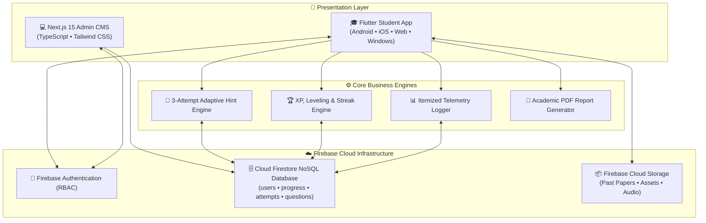

# 🌟 SisuPal (සිසුපල්) V2 — Gamified Primary Learning & Telemetry Ecosystem

<p align="center">
  
</p>

<p align="center">
  <strong>An Intelligent, Narrative-Driven Educational Platform Tailored for Sri Lankan Grade 5 Scholarship Students (ශිෂ්‍යත්ව විභාගය).</strong>
</p>

<p align="center">
  
  
  
  
  
  
  
</p>

---

## 📖 Table of Contents

- [Overview](#-overview)
- [Key Features](#-key-features)
  - [1. Student Learning & Gamification Hub (Flutter)](#1-student-learning--gamification-hub-flutter)
  - [2. 3-Attempt Adaptive Diagnostic Engine](#2-3-attempt-adaptive-diagnostic-engine)
  - [3. Interactive Mini-Games Suite](#3-interactive-mini-games-suite)
  - [4. Parent Dashboard 2.0 & Analytics Portal](#4-parent-dashboard-20--analytics-portal)
  - [5. Admin & Teacher CMS (Next.js 15)](#5-admin--teacher-cms-nextjs-15)
- [System Architecture](#-system-architecture)
- [Project Directory Structure](#-project-directory-structure)
- [Getting Started](#-getting-started)
  - [Prerequisites](#prerequisites)
  - [Flutter Student Application Setup](#flutter-student-application-setup)
  - [Next.js Admin CMS Setup](#nextjs-admin-cms-setup)
- [Firebase Cloud Infrastructure](#-firebase-cloud-infrastructure)
- [Building for Production (Android Release APK)](#-building-for-production-android-release-apk)
- [License & Contributing](#-license--contributing)

---

## 🚀 Overview

**SisuPal (සිසුපල්)** is a modern, comprehensive educational ecosystem developed to transform primary education for Sri Lankan Grade 5 Scholarship candidates. By fusing **bilingual interactive narratives (Sinhala & English)**, **pedagogical scaffolding**, **real-time itemized telemetry**, and **parent-teacher oversight**, SisuPal provides an encouraging and measurable learning journey.

### The System Comprises Two Core Applications:
1. **SisuPal Student App (`Flutter`)**: Multi-platform client (Android, iOS, Web, Windows) with interactive adventures, XP leveling, streak tracking, audio feedback, and 7 mini-games.
2. **SisuPal Admin & Teacher CMS (`Next.js 15`)**: A high-performance web console for managing curriculum modules, inspecting telemetry across all 25 districts, authoring question banks, and exporting student diagnostic reports.

---

## ✨ Key Features

### 1. Student Learning & Gamification Hub (Flutter)
- **Mathematical Leveling Model**: Level progression calculated via $\text{Level} = \lfloor \text{XP} / 100 \rfloor + 1$ with dynamic title badges (*Beginner 🌿*, *Explorer 🔍*, *Learner 📚*, *Scholar 🎓*, *Master 👑*, *Legend 🏆*).
- **Daily Login Streak Counter**: Encourages daily consistent learning with animated streak fire effects (`StreakFlame`).
- **Story-Driven Lesson Pathways**:
  - 🥭 **Lesson 1 — Quest for the Golden Mango**: Place values, expanded notation, and 4-digit number mastery.
  - 🚂 **Lesson 2 — The Great Number Train**: Number sequencing, ascending/descending ordering, and rounding to nearest 10/100/1000.
- **Interactive Student Guide (Parrot Guide 🦜)**: A friendly, dual-language interactive walkthrough explaining XP, hints, and games.

---

### 2. 3-Attempt Adaptive Diagnostic Engine
SisuPal’s proprietary zero-penalty hint architecture encourages deep conceptual understanding:
- **Attempt 1 (Leo the Lion 🦁)**: Light, intuitive hint nudging the student in the right direction.
- **Attempt 2 (Ella the Elephant 🐘)**: Visual place-value column breakdown and guided sub-steps.
- **Attempt 3 (Worked Solution 💡)**: Full step-by-step mathematical explanation.
- **Mistakes Bank**: Automatically captures unmastered questions into a dedicated review sandbox for targeted practice.

---

### 3. Interactive Mini-Games Suite
Seven gamified exercises reinforcing scholarship core skills:
- 🎯 **Number Archery**: Rounding numbers to the nearest 10 and 100.
- 🌊 **Abacus River**: Visual bead arithmetic and place value representation.
- 🪷 **Lily Pad Leap**: Number sequencing and skip-counting patterns.
- 🫧 **Bubble Cannon**: Rapid mental arithmetic and bubble popping.
- 🔢 **Digit Builder**: Creating the largest/smallest numbers from randomized digit cards.
- 🥭 **Golden Mango Chest**: Value comparison and arithmetic operations.
- 🚂 **Cargo Train Station**: Multi-digit ordering and freight sorting.

---

### 4. Parent Dashboard 2.0 & Analytics Portal
- 🛡️ **Parent Security PIN Gate**: 4-digit PIN verification modal with shake animation to safeguard parent analytics.
- 📊 **Live Telemetry & Accuracy Tracking**: Real-time accuracy %, streak count, mastered concepts, and weekly learning trend curves.
- 🎯 **Focus Areas & 1-Tap Remedial Practice**: Flags struggling concepts and offers immediate 1-tap navigation directly into targeted practice.
- 📄 **Official PDF Progress Report Card**: Generates a high-quality, printable Sri Lankan National Primary Curriculum assessment card complete with KPI grids, competency lists, and parent/teacher signature lines.

---

### 5. Admin & Teacher CMS (Next.js 15)
- 👥 **25-District Student Roster**: Filter and inspect student telemetry, streaks, and quiz accuracy by district.
- 📚 **Curriculum & Story Builder**: Real-time CRUD for lessons, concept checkpoints, and story dialogues.
- 📝 **40-Question Scholarship Bank CRUD**: Categorized management of official exam questions.
- 🎥 **Media Hub**: Curated YouTube video lessons and downloadable PDF past papers.

---

## 🏛️ System Architecture



---

## 📂 Project Directory Structure

```text
SisupalV2/
├── admin-dashboard/            # 💻 Next.js 15 Admin & Teacher CMS
│   ├── app/                    # Next.js App Router pages & API routes
│   │   ├── admin/              # District rosters, question manager, media hub
│   │   └── layout.tsx          # Root layout & navigation providers
│   ├── components/             # Reusable React & Tailwind UI components
│   ├── lib/                    # Firebase Admin SDK & utility helpers
│   └── package.json            # Node.js dependencies
│
├── android/                    # 🤖 Android Native Configuration & ProGuard Rules
│   ├── app/
│   │   ├── build.gradle        # minSdkVersion 21, targetSdk 34, multiDex
│   │   └── proguard-rules.pro  # Firebase & Flutter R8 shrinking rules
│   └── gradle.properties       # JVM heap args & TLS network optimizations
│
├── assets/                     # 🎨 Static Assets & Media
│   ├── images/                 # Lesson backgrounds, character sprites & illustrations
│   │   └── games/              # Mini-game graphics & UI elements
│   ├── pdfs/                   # Grade 5 Scholarship past exam papers
│   └── sounds/                 # Haptic audio sound effects (.mp3)
│
├── lib/                        # 🎓 Flutter Application Source Code
│   ├── data/                   # Static lesson data & question repositories
│   ├── models/                 # Data models (Analytics, Progress, Questions)
│   ├── screens/                # UI Screens
│   │   ├── maths/              # Lesson adventures & exercise engines
│   │   ├── games_screen.dart   # Mini-games launcher
│   │   ├── maths_kingdom_screen.dart # Maths Kingdom curriculum path
│   │   ├── parent_dashboard.dart     # Parent analytics & telemetry portal
│   │   ├── student_dashboard.dart    # Main student home dashboard
│   │   └── user_guide_screen.dart    # Bilingual interactive guide
│   ├── services/               # Services (Auth, Progress, Telemetry, PDF)
│   ├── utils/                  # App theme, colors & design tokens
│   ├── widgets/                # Reusable UI widgets & animated components
│   └── main.dart               # Flutter application entrypoint
│
├── pubspec.yaml                # Flutter dependencies & asset registrations
└── PROJECT_SUMMARY.md          # In-depth architectural master documentation
```

---

## 🛠️ Getting Started

### Prerequisites
- **Flutter SDK**: `>= 3.29.0`
- **Dart SDK**: `>= 3.6.0`
- **Node.js**: `>= 18.17.0` & **npm**
- **Java Development Kit (JDK)**: `>= 17`
- **Firebase Project**: Configured with Authentication & Firestore

---

### Flutter Student Application Setup

1. **Clone the Repository**:
   ```bash
   git clone https://github.com/pills1/SisupalV2.git
   cd SisupalV2
   ```

2. **Install Flutter Dependencies**:
   ```bash
   flutter pub get
   ```

3. **Configure Firebase**:
   - Place your `google-services.json` inside `android/app/`.
   - Ensure Firebase Authentication (Email/Password) and Cloud Firestore are provisioned.

4. **Run on Connected Device or Web**:
   ```bash
   # Run on Chrome
   flutter run -d chrome

   # Run on Android Emulator / Physical Device
   flutter run
   ```

---

### Next.js Admin CMS Setup

1. **Navigate to the Admin Dashboard directory**:
   ```bash
   cd admin-dashboard
   ```

2. **Install Node Dependencies**:
   ```bash
   npm install
   ```

3. **Configure Environment Variables**:
   Create a `.env.local` file in `admin-dashboard/`:
   ```env
   NEXT_PUBLIC_FIREBASE_API_KEY=your_api_key
   NEXT_PUBLIC_FIREBASE_AUTH_DOMAIN=your_project.firebaseapp.com
   NEXT_PUBLIC_FIREBASE_PROJECT_ID=your_project_id
   NEXT_PUBLIC_FIREBASE_STORAGE_BUCKET=your_project.appspot.com
   NEXT_PUBLIC_FIREBASE_MESSAGING_SENDER_ID=your_sender_id
   NEXT_PUBLIC_FIREBASE_APP_ID=your_app_id
   ```

4. **Start the Development Server**:
   ```bash
   npm run dev
   ```
   Open `http://localhost:3000` to access the Admin Console.

---

## ☁️ Firebase Cloud Infrastructure

### Firestore Schema Layout:
```text
users/ {userId}
  ├── xp: int
  ├── streak: int
  ├── grade: int (5)
  ├── parentPin: string ("1234")
  ├── progress/
  │     └── mathematics: { completedLessons: [], completedConcepts: [] }
  ├── question_attempts/
  │     └── {attemptId}: { questionId, isCorrect, hintLevel, timestamp }
  ├── exam_results/
  │     └── {examId}: { examTitle, score, total, date }
  └── mistakes/
        └── {questionId}: { questionData, lastAttemptDate }
```

---

## 📦 Building for Production (Android Release APK)

The Android configuration is optimized with ProGuard rules, multidex, and `minSdkVersion = 21`:

```bash
# Clean previous build artifacts
flutter clean
flutter pub get

# Build Release APK
flutter build apk --release

# (Optional) Build split per-ABI APKs (~20MB each)
flutter build apk --release --split-per-abi
```

Compiled APK output location:
`build/app/outputs/flutter-apk/app-release.apk`

---

## 📄 License & Contributing

This project is licensed under the **MIT License**. Contributions, bug reports, and pull requests are welcome!

<p align="center">
  Made with ❤️ for Sri Lankan Primary Students • <strong>SisuPal Team</strong>
</p>
